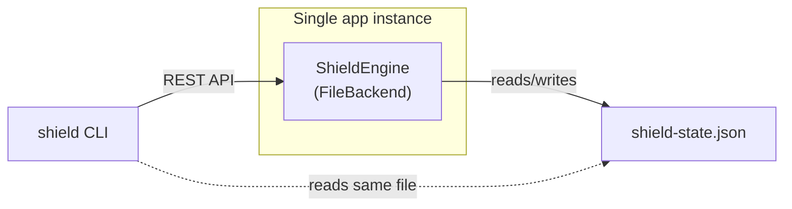
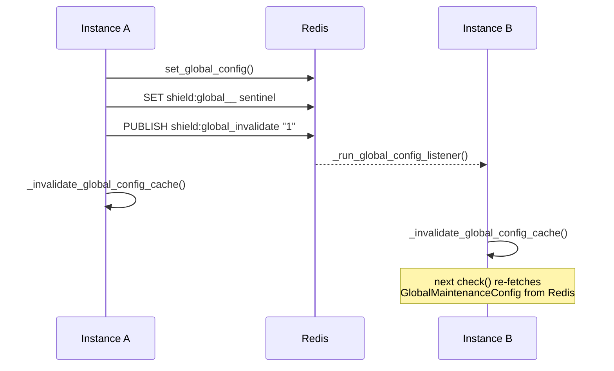
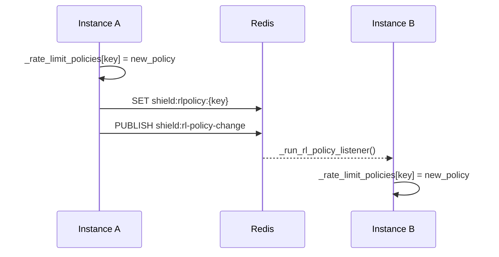
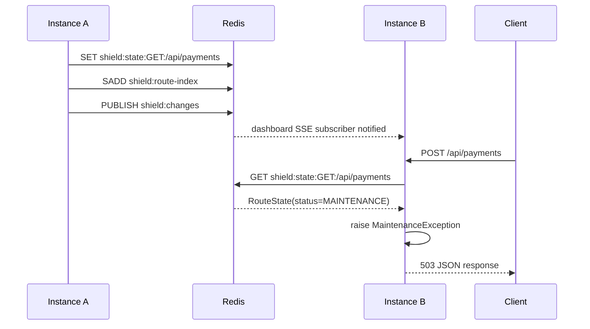
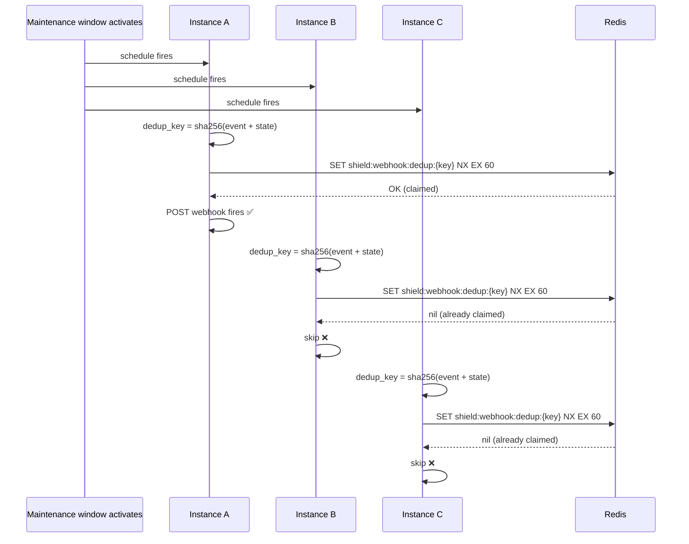
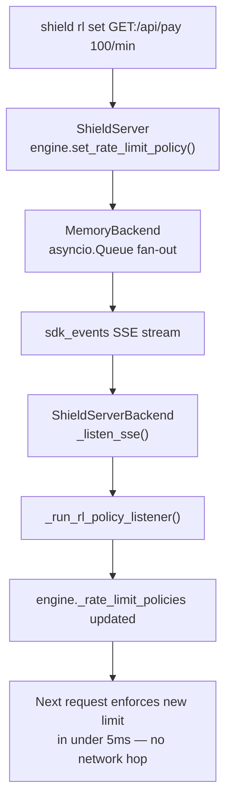
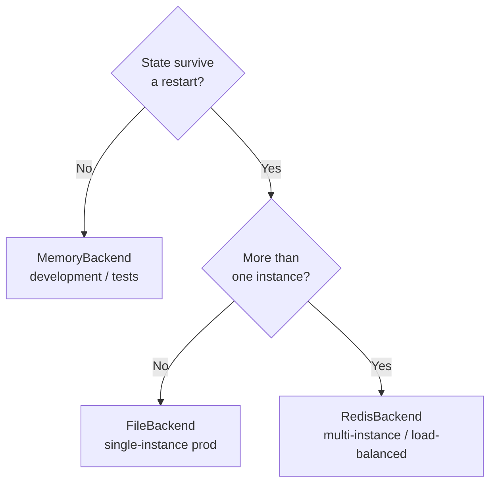

# Distributed Deployments

This guide explains how api-shield behaves when your application runs across multiple instances: load-balanced replicas, rolling deploys, or horizontally-scaled containers. It covers what each backend guarantees, where the boundaries are, and how to choose the right setup for your architecture.

---

## The core question: where does state live?

Every request that hits api-shield goes through a single chokepoint: `engine.check()`. The engine reads route state from the backend, evaluates it against the request, and either allows it through or raises a `ShieldException`. In a single-instance deployment this is straightforward. In a multi-instance deployment the question becomes: **when Instance A changes the state of a route, how quickly does Instance B see that change?**

The answer depends entirely on which backend you use.

---

## Backend capability matrix

| Capability | `MemoryBackend` | `FileBackend` | `RedisBackend` |
|---|---|---|---|
| State persistence across restarts | No | Yes | Yes |
| Shared state across instances | No | Shared file only | Yes |
| Per-route state sync (real-time) | In-process only | No | Yes — pub/sub |
| Global maintenance sync (real-time) | In-process only | No | Yes — pub/sub |
| Rate limit policy sync (real-time) | In-process only | No | Yes — pub/sub |
| Dashboard SSE live updates | In-process only | No — polling fallback | Yes |
| `subscribe()` pub/sub | `asyncio.Queue` | `NotImplementedError` | Redis pub/sub |
| `subscribe_global_config()` | `NotImplementedError` | `NotImplementedError` | Redis pub/sub |
| `subscribe_rate_limit_policy()` | `asyncio.Queue` | `NotImplementedError` | Redis pub/sub |
| Fail-open on backend error | Always | Always | Always |
| Recommended for | Dev / tests | Single-instance prod | Multi-instance prod |

---

## MemoryBackend

State lives in a Python `dict` inside the `ShieldEngine` object. It is never written to disk, never shared over a network, and is lost the moment the process exits.

**In a multi-instance deployment, each instance has its own isolated world.** A `shield disable` command that reaches Instance A through the admin API will disable the route on Instance A only. Instance B continues serving the route as if nothing happened.

`subscribe()` is implemented using `asyncio.Queue`. This works correctly for the in-process dashboard SSE feed, since the dashboard and the engine share the same Python process and changes are visible immediately. It provides no cross-process benefit.

**Do not use `MemoryBackend` in any deployment where more than one process serves traffic.**

---

## FileBackend

State is written to a JSON (or YAML/TOML) file on disk. The file survives restarts. A second process pointing to the same file path can read the same state.

### How it works internally

`FileBackend` maintains a **write-through in-memory cache**. All reads are served from `_states: dict[str, Any]` in memory, with zero file I/O on the hot path. Writes update the dict immediately (O(1)) and schedule a **debounced flush** (50ms window) to disk. State mutations (`set_state`, `delete_state`) bypass the debounce and flush synchronously for durability.

```mermaid
graph LR
    subgraph read["Read path"]
        RC["engine.check()"] --> RB["backend.get_state()"] --> RM["_states&#91;path&#93;\nO(1) lookup"] --> RR["return RouteState"]
    end
    subgraph write["Write path"]
        WC["engine.disable()"] --> WB["backend.set_state()"] --> WM["_states&#91;path&#93; = new_state\nO(1), immediate"] --> WD["_flush_to_disk()\nwrite JSON to disk"]
    end
```



### The multi-instance problem

Because all reads are served from the in-memory cache, **a second process writing to the same file will not be seen by the first process until it restarts or reloads its cache.** There is no file watcher, no inotify integration, and no polling loop that re-reads the file at runtime.

This is intentional. Adding a file watcher introduces serious problems:

- **`os.stat` polling is unreliable on network filesystems.** NFS, CIFS, and Docker volume mounts do not always propagate `mtime` changes reliably across hosts. The environments where you need multi-instance support are exactly the environments where file watching would silently fail.
- **Concurrent writes require OS-level file locking.** The current design assumes one writer. Two processes writing simultaneously, even with the `asyncio.Lock` inside each process, can race at the OS level. Making this safe requires `fcntl`/`msvcrt` file locking, which is platform-specific and significantly more complex.
- **It recreates Redis, poorly.** You would end up with an ad-hoc pub/sub system built on top of a JSON file with none of the guarantees and all of the failure modes.

### When FileBackend is the right choice

`FileBackend` is designed for the **single-instance + CLI** pattern:



The CLI talks to the app's `ShieldAdmin` REST API. The API writes to the in-memory cache (which flushes to disk). The file persists across restarts. This is the complete, correct workflow for `FileBackend`. No cross-instance sync is needed because there is only one instance.

**Do not use `FileBackend` across multiple instances that serve concurrent traffic.**

---

## RedisBackend

Redis is the fully distributed backend. All instances share state through a single Redis store. State changes made by any instance are visible to all other instances immediately.

### Key schema

```
shield:state:{path}          STRING   JSON-serialised RouteState
shield:route-index           SET      All registered route paths (safe SMEMBERS instead of KEYS scan)
shield:audit                 LIST     Global audit log, newest-first (LPUSH + LTRIM 1000)
shield:audit:path:{path}     LIST     Per-path audit log for O(limit) filtered queries
shield:rlpolicy:{METHOD:path} STRING  JSON-serialised RateLimitPolicy
shield:rl-policy-index       SET      All registered rate limit policy keys
shield:global_invalidate     CHANNEL  Pub/sub — fires on every global maintenance config change
shield:rl-policy-change      CHANNEL  Pub/sub — fires on every rate limit policy set or delete
shield:changes               CHANNEL  Pub/sub — fires on every set_state call
```

`shield:route-index` exists specifically to avoid `KEYS shield:state:*`. `KEYS` is an O(keyspace) blocking command that freezes Redis on busy production instances. `SMEMBERS` on the dedicated route-index set is safe to use at any time.

### Per-route state: immediate consistency

Every call to `set_state()` (triggered by `engine.disable()`, `engine.set_maintenance()`, etc.) runs atomically in a Redis pipeline:

```python
pipe.set(f"shield:state:{path}", payload)   # write state
pipe.sadd("shield:route-index", path)       # maintain index
pipe.publish("shield:changes", payload)     # notify subscribers
await pipe.execute()
```

The write and the notification are atomic. Any instance subscribed to `shield:changes` (the dashboard SSE endpoint) receives the new `RouteState` immediately. The next `engine.check()` call on any instance reads fresh state from Redis, as there is no in-process per-route state cache.

### Global maintenance: distributed cache invalidation

Global maintenance (`engine.enable_global_maintenance()`) is applied to every request before per-route checks. Because it is checked on every single request, the engine caches the `GlobalMaintenanceConfig` in-process to avoid a Redis round-trip on the hot path.

The risk in a multi-instance deployment: Instance A enables global maintenance and invalidates its local cache. Instance B's cache still holds the old (disabled) config, so it will serve requests as if global maintenance is off until its cache is cleared.

This is solved through a dedicated invalidation channel:



`ShieldEngine.start()` creates a background `asyncio.Task` that runs `_run_global_config_listener()`. This task iterates `backend.subscribe_global_config()` indefinitely. Each message arrival from `shield:global_invalidate` triggers an immediate cache flush. The next `engine.check()` call re-fetches `GlobalMaintenanceConfig` from Redis, observing the change made by Instance A.

For `MemoryBackend` and `FileBackend`, `subscribe_global_config()` raises `NotImplementedError`. The listener task catches this, exits immediately, and the engine falls back to per-process cache behaviour with no error and no performance impact.

`start()` is called automatically in two places:

- `ShieldEngine.__aenter__`: for CLI scripts using `async with ShieldEngine(...) as engine:`
- `ShieldRouter.register_shield_routes()`: at FastAPI application startup

You do not need to call `start()` manually unless you are using the engine outside of these two contexts.

### Rate limit policies: distributed sync

Rate limit policies (`@rate_limit` limits, algorithm, key strategy) are cached in each instance's `_rate_limit_policies` dict for fast O(1) lookup on every request. Without cross-instance sync, a policy update applied via the admin API or CLI would only take effect on the worker that handled that request — all other workers would continue enforcing the old limit.

This is solved with the same invalidation pattern used for global maintenance:



`ShieldEngine.start()` creates a `shield-rl-policy-listener` background task. Each message on `shield:rl-policy-change` carries the full policy payload (for `set`) or just the key (for `delete`), so the receiving instance applies the delta directly without an extra Redis round-trip.

For `FileBackend`, `subscribe_rate_limit_policy()` raises `NotImplementedError`. The listener exits silently — `FileBackend` is single-process only, so cross-process sync is unnecessary.

`MemoryBackend` now implements `subscribe_rate_limit_policy()` via an `asyncio.Queue`, meaning the Shield Server can broadcast RL policy events to all SDK clients connected over SSE — see [Rate limit policy SSE propagation](#rate-limit-policy-sse-propagation) below.

### The request lifecycle across instances

Here is the complete flow for a request arriving at Instance B when Instance A has placed `/api/payments` in maintenance:



There is no in-process cache for per-route state. Every `engine.check()` call on `RedisBackend` is a single `GET` command. Round-trip latency on a local Redis is typically under 0.5ms, well within the < 2ms budget defined in the performance spec.

### Scheduler behaviour across instances

Each instance runs its own `MaintenanceScheduler`. When a maintenance window is scheduled, it is persisted to Redis. On startup, each instance calls `scheduler.restore_from_backend()` which reads all future windows from the backend and re-schedules them as local `asyncio.Task` objects.

When the window's `start` time arrives, every instance independently calls `engine.set_maintenance()`. Because `set_maintenance()` is idempotent (writing the same `MAINTENANCE` state twice is a no-op from Redis's perspective), this is safe.

### Webhook deduplication

Without deduplication, webhooks would fire once per instance per event: three instances would mean three `maintenance_on` deliveries for a single window activation. api-shield prevents this with a `SET NX` claim in Redis before any HTTP POST is sent.



The dedup key is a SHA-256 hash of `event + path + serialised RouteState`. Because the scheduler produces an identical `RouteState` on all instances for the same window activation (same path, same status, same window start/end), the key is fleet-wide deterministic. Only the first instance to win the atomic `SET NX` fires.

The dedup key expires after 60 seconds. If the winning instance crashes before completing delivery, the key expires and re-delivery is possible on the next scheduler poll cycle.

### OpenAPI schema staleness

The OpenAPI schema filter (`apply_shield_to_openapi`) uses a monotonic `_schema_version` counter inside each `ShieldEngine` instance to decide when to rebuild the cached schema. This counter is incremented on every local state change and is not shared across instances.

**When Instance A disables a route, Instance B's `/docs` and `/openapi.json` will continue to show that route until Instance B's own schema cache is invalidated (by a local state change or a restart).** For most production deployments this is acceptable, as developer-facing docs are not on the critical request path and the actual request handling (via `engine.check()`) is always consistent thanks to Redis.

If you need fully consistent OpenAPI schemas across instances, you can force a cache refresh by calling `app.openapi.cache_clear()` (or the equivalent for your schema caching setup) in response to `shield:changes` pub/sub messages.

---

## Rate limit policy SSE propagation

When using **Shield Server + ShieldSDK**, rate limit policies set via the CLI (`shield rl set`) or the dashboard are immediately broadcast to all connected SDK clients over the persistent SSE stream — no restart required.

The SSE stream now carries typed envelopes:

```
data: {"type": "state",     "payload": {...RouteState...}}
data: {"type": "rl_policy", "action": "set",    "key": "GET:/api/pay", "policy": {...}}
data: {"type": "rl_policy", "action": "delete", "key": "GET:/api/pay"}
```

When `ShieldServerBackend` receives an `rl_policy` event, it updates its local `_rl_policy_cache` and notifies the engine's existing `_run_rl_policy_listener()` background task, which applies the policy change to `engine._rate_limit_policies` immediately. The propagation path is:



Per-request enforcement reads `engine._rate_limit_policies` synchronously — no network hop, no lock, zero added latency.

---

## Choosing the right backend



---

## Fail-open guarantee

Regardless of backend, api-shield will **never take down your API due to its own backend being unreachable**. Every `backend.get_state()` call is wrapped in a try/except inside `engine.check()`:

```python
try:
    return await self.backend.get_state(key)
except KeyError:
    continue       # path not registered → treat as ACTIVE
except Exception:
    logger.exception("shield: backend error — failing open")
    return None    # allow the request through
```

If Redis goes down, all `engine.check()` calls fail-open: every request passes through as if all routes are `ACTIVE`. Shield logs the errors at `ERROR` level but never surfaces them as HTTP failures to your clients. Your API continues to serve traffic; you just lose the protection layer temporarily.

The same applies to global maintenance: if reading `GlobalMaintenanceConfig` from the backend raises an exception, the exception is caught and the request is allowed through.

---

## Production checklist for multi-instance deployments

- [ ] Use `RedisBackend` with a dedicated Redis instance (not shared with application cache)
- [ ] Set `SHIELD_REDIS_URL` via environment variable; do not hardcode credentials
- [ ] Use Redis database `0` for application data, a separate DB (e.g. `15`) for tests
- [ ] Mount `ShieldAdmin` behind authentication (`auth=("user", "pass")` or a custom `ShieldAuthBackend`)
- [ ] Configure webhooks to a single endpoint (e.g. Slack, PagerDuty) rather than per-instance receivers to avoid duplicate alerts from the scheduler
- [ ] Use `async with engine:` in your app lifespan to ensure `backend.startup()` / `backend.shutdown()` and `engine.start()` / `engine.stop()` are called cleanly
- [ ] Set `SHIELD_ENV` correctly per deployment environment so `@env_only` gating works as intended
- [ ] Test fail-open behaviour in staging by stopping Redis and verifying that traffic continues to flow
