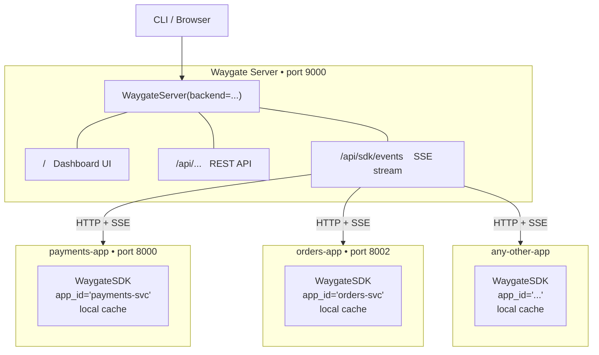
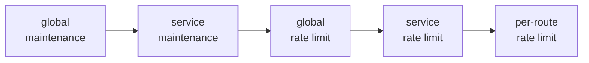

# Waygate Server Guide

The Waygate Server is a standalone ASGI application that acts as the centralised control plane for multi-service architectures. Services connect to it via **WaygateSDK**, which enforces rules locally using an in-process cache kept fresh over a persistent SSE connection — so there is **zero per-request network overhead**.

---

## When to use Waygate Server

Use the embedded `WaygateAdmin` (single-mount) pattern when you have **one service**. Move to Waygate Server when:

- You run **two or more independent services** and want to manage all their routes from one dashboard and one CLI target.
- You want a **dedicated control plane** that survives individual service restarts.
- You need per-service namespacing so `payments-service:/api/payments` and `orders-service:/api/payments` never collide.

---

## Architecture



**Key properties:**

- The Waygate Server is the single source of truth for route state.
- SDK clients pull state on startup via `GET /api/routes` and receive live updates via `GET /api/sdk/events` (SSE).
- All enforcement happens locally inside each SDK client — the Waygate Server is never on the hot path.
- The CLI always points at the Waygate Server, never at individual services.

---

## Quick setup

### 1. Waygate Server

```python title="waygate_server_app.py"
from waygate.server import WaygateServer
from waygate import MemoryBackend

# MemoryBackend is fine for development.
# Use FileBackend for state persistence or RedisBackend for HA.
waygate_app = WaygateServer(
    backend=MemoryBackend(),
    auth=("admin", "secret"),
    # secret_key="stable-key-for-persistent-tokens",
    # token_expiry=86400,   # 24 h
)
```

```bash
uvicorn waygate_server_app:waygate_app --port 9000
```

### 2. Service app

```python title="payments_app.py"
from fastapi import FastAPI
from waygate.sdk import WaygateSDK
from waygate.fastapi import WaygateRouter, maintenance, force_active

sdk = WaygateSDK(
    server_url="http://localhost:9000",
    app_id="payments-service",
    # token="<long-lived-service-token>",
    reconnect_delay=5.0,
)

app = FastAPI()
sdk.attach(app)   # wires WaygateMiddleware + startup/shutdown hooks

router = WaygateRouter(engine=sdk.engine)

@router.get("/health")
@force_active
async def health():
    return {"status": "ok"}

@router.get("/api/payments")
@maintenance(reason="Payment processor upgrade")
async def get_payments():
    return {"payments": []}

app.include_router(router)
```

```bash
uvicorn payments_app:app --port 8000
```

### 3. CLI

```bash
waygate config set-url http://localhost:9000
waygate login admin              # password: secret
waygate services                 # list all connected services
waygate status --service payments-service
waygate enable /api/payments
```

---

## `sdk.attach(app)` — what it does

`attach()` wires three things into the FastAPI app:

1. **`WaygateMiddleware`** — checks every request against the local state cache (zero network overhead).
2. **Startup hook** — syncs state from the Waygate Server, opens the SSE listener, discovers `@waygate_meta__`-decorated routes, and registers any new ones with the server.
3. **Shutdown hook** — closes the SSE connection and HTTP client cleanly.

---

## Multi-service CLI workflow

### `WAYGATE_SERVICE` env var

Set once, and every subsequent command (`status`, `enable`, `disable`, `maintenance`, `schedule`) scopes itself to that service automatically:

```bash
export WAYGATE_SERVICE=payments-service
waygate status               # only payments routes
waygate disable GET:/api/payments --reason "hotfix"
waygate enable  GET:/api/payments
waygate current-service      # confirm active context
```

An explicit `--service` flag always overrides the env var:

```bash
export WAYGATE_SERVICE=payments-service
waygate status --service orders-service   # acts on orders, ignores env var
```

### Unscoped commands

Clear `WAYGATE_SERVICE` to operate across all services at once:

```bash
unset WAYGATE_SERVICE
waygate status               # routes from all services
waygate audit                # audit log across all services
waygate global disable --reason "emergency maintenance"
waygate global enable
```

---

## Global maintenance in multi-service environments

`waygate global enable` and `waygate global disable` operate on the Waygate Server and affect **every route across every connected service** simultaneously. Use this for fleet-wide outages or deployments where all services must be taken offline at once.

```bash
# Block all routes on all services
waygate global enable --reason "Deploying v3" --exempt /health --exempt /ready

# Restore all routes
waygate global disable
```

---

## Per-service maintenance

Per-service maintenance puts **all routes of one service** into maintenance mode without affecting other services. SDK clients with a matching `app_id` receive the sentinel over SSE and treat all their routes as in maintenance — no individual route changes needed.

### From the engine (programmatic)

```python
# Put payments-service into maintenance
await engine.enable_service_maintenance(
    "payments-service",
    reason="DB migration",
    exempt_paths=["/health"],
)

# Restore
await engine.disable_service_maintenance("payments-service")

# Inspect
cfg = await engine.get_service_maintenance("payments-service")
print(cfg.enabled, cfg.reason)
```

### From the REST API

```http
POST /api/services/payments-service/maintenance/enable
Authorization: Bearer <token>
Content-Type: application/json

{"reason": "DB migration", "exempt_paths": ["/health"]}
```

```http
POST /api/services/payments-service/maintenance/disable
```

### From the CLI

`waygate sm` and `waygate service-maintenance` are aliases for the same command group:

```bash
# Enable — all routes of payments-service return 503
waygate sm enable payments-service --reason "DB migration"
waygate sm enable payments-service --reason "Upgrade" --exempt /health

# Check current state
waygate sm status payments-service

# Restore
waygate sm disable payments-service
```

### From the dashboard

Open the Routes page and select the service using the service filter. A **Service Maintenance** card appears with Enable and Disable controls.

!!! tip "Use `@force_active` on health checks"
    Health and readiness endpoints should always be decorated with `@force_active` so they are never affected by global or per-service maintenance mode.

### Useful discovery commands

```bash
waygate services             # list all services registered with the Waygate Server
waygate current-service      # show the active WAYGATE_SERVICE context
```

---

## Backend choice for the Waygate Server

The backend affects **only the Waygate Server process**. SDK clients always receive live updates via SSE regardless of which backend the Waygate Server uses.

| Scenario | Waygate Server backend | Notes |
|---|---|---|
| Development / single developer | `MemoryBackend` | State lost on Waygate Server restart |
| Production, single Waygate Server | `FileBackend` | State survives restarts; single process only |
| Production, multiple Waygate Server nodes (HA) | `RedisBackend` | All nodes share state via pub/sub |

```python
# Development
waygate_app = WaygateServer(backend=MemoryBackend(), auth=("admin", "secret"))

# Production — persistent single node
from waygate import FileBackend
waygate_app = WaygateServer(backend=FileBackend("waygate-state.json"), auth=("admin", "secret"))

# Production — HA / load-balanced Waygate Server
from waygate import RedisBackend
waygate_app = WaygateServer(backend=RedisBackend("redis://redis:6379/0"), auth=("admin", "secret"))
```

---

## Shared rate limit counters across SDK replicas

When a service runs multiple replicas (e.g. three `payments-app` pods), each SDK client enforces rate limits independently using its own in-process counters. This means a `100/minute` limit is enforced as 100 per replica — effectively `100 × num_replicas` across the fleet.

To enforce the limit **across all replicas combined**, pass a shared `RedisBackend` as `rate_limit_backend`:

```python
from waygate import RedisBackend

sdk = WaygateSDK(
    server_url="http://waygate-server:9000",
    app_id="payments-service",
    rate_limit_backend=RedisBackend(url="redis://redis:6379/1"),
)
```

Use a **different Redis database** (or a different Redis instance) from the one used by the Waygate Server's backend to avoid key collisions.

### Full deployment matrix

| Services | Replicas per service | Waygate Server backend | SDK `rate_limit_backend` |
|---|---|---|---|
| 1 | 1 | Use embedded `WaygateAdmin` instead | — |
| 2+ | 1 each | `MemoryBackend` or `FileBackend` | not needed |
| 2+ | 2+ each (shared counters) | `RedisBackend` | `RedisBackend` (different DB) |
| 2+ | 2+ each (independent counters per replica) | `RedisBackend` | not needed |

---

## Per-service rate limits

A per-service rate limit applies a single policy to **all routes of one service** without configuring each route individually. It is checked after the all-services global rate limit and before any per-route limit:



Configure it with the `waygate srl` CLI (also available as `waygate service-rate-limit`):

```bash
# Cap all payments-service routes at 1000 per minute per IP
waygate srl set payments-service 1000/minute

# With options
waygate srl set payments-service 500/minute --algorithm sliding_window --key ip
waygate srl set payments-service 2000/hour --burst 50 --exempt /health --exempt GET:/metrics

# Inspect, pause, reset counters, remove
waygate srl get     payments-service
waygate srl disable payments-service
waygate srl enable  payments-service
waygate srl reset   payments-service
waygate srl delete  payments-service
```

From the dashboard: open the **Rate Limits** tab and select a service using the service filter. A **Service Rate Limit** card appears above the policies table with controls to configure, pause, reset, and remove the policy.

The service rate limit uses the same `GlobalRateLimitPolicy` model as the all-services global rate limit. It is stored in the backend under a sentinel key and survives Waygate Server restarts on `FileBackend` or `RedisBackend`.

!!! note "Independent layers"
    The all-services global rate limit (`waygate grl`) and the per-service rate limit (`waygate srl`) are independent. A request must pass both before reaching per-route checking. You can configure one, both, or neither.

---

## SSE event types

The Waygate Server's `GET /api/sdk/events` stream carries two event types:

### Route state changes

```
data: {"type": "state", "payload": {...RouteState JSON...}}
```

Emitted whenever a route is enabled, disabled, put in maintenance, etc. The SDK client updates its local cache and the change is visible on the very next `engine.check()` call.

### Rate limit policy changes

```
data: {"type": "rl_policy", "action": "set",    "key": "GET:/api/pay", "policy": {...}}
data: {"type": "rl_policy", "action": "delete", "key": "GET:/api/pay"}
```

Emitted whenever `waygate rl set` or `waygate rl delete` (or the dashboard) changes a rate limit policy. The SDK client applies the change to its local `engine._rate_limit_policies` dict immediately via the existing `_run_rl_policy_listener()` background task.

Both event types are delivered over the same persistent SSE connection. Propagation latency is the SSE round-trip — typically under 5 ms on a LAN.

---

## Authentication

### No auth (development)

If `auth` is omitted, the Waygate Server is open — no credentials required anywhere:

```python
waygate_app = WaygateServer(backend=MemoryBackend())  # no auth=
```

```python
sdk = WaygateSDK(
    server_url="http://waygate-server:9000",
    app_id="payments-service",
    # no token, username, or password needed
)
```

### Dashboard and CLI users

Use `auth=("admin", "secret")` for a single admin user, or pass a list for multiple users:

```python
waygate_app = WaygateServer(
    backend=MemoryBackend(),
    auth=[("alice", "pw1"), ("bob", "pw2")],
)
```

Human users authenticate via the dashboard login form or `waygate login` in the CLI. Their sessions last `token_expiry` seconds (default 24 h).

### SDK service authentication

SDK service apps have two options for authenticating with the Waygate Server.

#### Option 1 — Auto-login with credentials (recommended)

Pass `username` and `password` directly to `WaygateSDK`. On startup the SDK calls `POST /api/auth/login` with `platform="sdk"` and obtains a long-lived token automatically — no manual token management required:

```python
import os
from waygate.sdk import WaygateSDK

sdk = WaygateSDK(
    server_url=os.environ["WAYGATE_SERVER_URL"],
    app_id="payments-service",
    username=os.environ["WAYGATE_USERNAME"],
    password=os.environ["WAYGATE_PASSWORD"],
)
```

Store credentials in your secrets manager or CI/CD environment variables and inject them at deploy time. The token is obtained once on startup and lives for `sdk_token_expiry` seconds (default 1 year) so the service never needs re-authentication.

#### Option 2 — Pre-issued token

Generate a token once via the CLI and pass it directly:

```bash
waygate config set-url http://waygate-server:9000
waygate login admin
# Copy the token from ~/.waygate/config.json
```

```python
sdk = WaygateSDK(
    server_url="http://waygate-server:9000",
    app_id="payments-service",
    token=os.environ["WAYGATE_TOKEN"],
)
```

### Separate token lifetimes

`token_expiry` and `sdk_token_expiry` are independent so human sessions can be short while service tokens are long-lived:

```python
waygate_app = WaygateServer(
    backend=RedisBackend(os.environ["REDIS_URL"]),
    auth=("admin", os.environ["WAYGATE_ADMIN_PASSWORD"]),
    secret_key=os.environ["WAYGATE_SECRET_KEY"],
    token_expiry=3600,          # dashboard / CLI users: 1 hour
    sdk_token_expiry=31536000,  # SDK service tokens: 1 year (default)
)
```

| Token platform | Issued to | Expiry param | Default |
|---|---|---|---|
| `"dashboard"` | Browser sessions | `token_expiry` | 24 h |
| `"cli"` | `waygate login` / CLI operators | `token_expiry` | 24 h |
| `"sdk"` | `WaygateSDK` auto-login | `sdk_token_expiry` | 1 year |

---

## Production checklist

- [ ] Use a stable `secret_key` on `WaygateServer` so issued tokens survive Waygate Server restarts
- [ ] Prefer `username`/`password` on `WaygateSDK` over pre-issued tokens — the SDK self-authenticates with a `sdk_token_expiry` token on each startup
- [ ] Set `token_expiry` (human sessions) and `sdk_token_expiry` (service tokens) independently
- [ ] Use `FileBackend` or `RedisBackend` on the Waygate Server so route state survives restarts
- [ ] Use `RedisBackend` on the Waygate Server if you run more than one Waygate Server instance (HA)
- [ ] Pass `rate_limit_backend=RedisBackend(...)` to each SDK if you need shared counters across replicas of the same service
- [ ] Set `reconnect_delay` on `WaygateSDK` to a value appropriate for your network (default 5 s)
- [ ] Exempt health and readiness probe endpoints with `@force_active`
- [ ] Test fail-open behaviour by stopping the Waygate Server and verifying that SDK clients continue to serve traffic against their last-known cache

---

## Further reading

- [**Distributed Deployments →**](distributed.md) — deep-dive on `MemoryBackend`, `FileBackend`, `RedisBackend` internals and the pub/sub patterns they use
- [**FastAPI adapter examples →**](../adapters/fastapi.md#waygate-server-single-service) — runnable `waygate_server.py` and `multi_service.py` examples
- [**CLI reference →**](../reference/cli.md) — all commands including `waygate services` and `waygate current-service`
