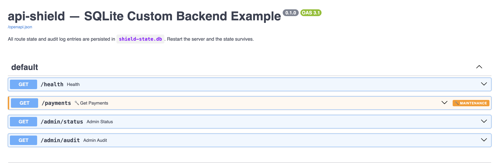
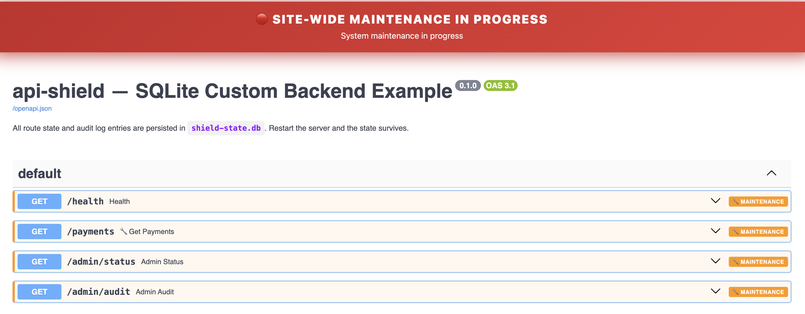

# Middleware

## ShieldMiddleware

`ShieldMiddleware` is a Starlette `BaseHTTPMiddleware` that intercepts every HTTP request and enforces route state by calling `engine.check()`.

```python
from fastapi import FastAPI
from shield.fastapi.middleware import ShieldMiddleware
from shield.core.engine import ShieldEngine

engine = ShieldEngine()

app = FastAPI()
app.add_middleware(ShieldMiddleware, engine=engine)
```

### Parameters

| Parameter | Type | Description |
|---|---|---|
| `engine` | `ShieldEngine` | The engine instance to delegate checks to |

### Request flow

```
Incoming HTTP request
        │
        ▼
ShieldMiddleware.dispatch()
        │
        ├─ Path in (/docs, /redoc, /openapi.json)?  → pass through
        ├─ Path starts with /shield/?               → pass through
        │
        ├─ Lazy-scan routes for __shield_meta__ (once on first request)
        │
        ├─ Route has force_active=True?             → pass through
        │
        ├─ engine.check(path, method)
        │       │
        │       ├─ Global maintenance ON?           → 503 JSON
        │       ├─ MAINTENANCE                      → 503 JSON + Retry-After
        │       ├─ DISABLED                         → 503 JSON
        │       ├─ ENV_GATED (wrong env)            → 404 (no body)
        │       ├─ DEPRECATED                       → call_next + inject headers
        │       └─ ACTIVE                           → call_next ✓
        │
        └─ call_next(request)
```

### Error responses

All error responses follow a consistent JSON structure:

```json
{
  "error": {
    "code": "MAINTENANCE_MODE",
    "message": "This endpoint is temporarily unavailable",
    "reason": "Database migration in progress",
    "path": "GET:/payments",
    "retry_after": "2025-06-01T04:00:00Z"
  }
}
```

| Scenario | HTTP status | `code` |
|---|---|---|
| Maintenance mode | 503 | `MAINTENANCE_MODE` |
| Route disabled | 503 | `ROUTE_DISABLED` |
| Env-gated (wrong env) | 404 | *(no body)* |
| Global maintenance | 503 | `MAINTENANCE_MODE` |

### Deprecation headers

For routes with status `DEPRECATED`, the middleware injects RFC-compliant response headers without blocking the request:

```http
Deprecation: true
Sunset: Sat, 01 Jan 2027 00:00:00 GMT
Link: </v2/users>; rel="successor-version"
```

---

## OpenAPI integration

### `apply_shield_to_openapi`

```python
from shield.fastapi.openapi import apply_shield_to_openapi

apply_shield_to_openapi(app, engine)
```

Monkey-patches `app.openapi()` to filter the schema based on current route states. Effects:

| Route status | Schema behaviour |
|---|---|
| `DISABLED` | Hidden from all schemas |
| `ENV_GATED` (wrong env) | Hidden from all schemas |
| `MAINTENANCE` | Summary prefixed with `🔧`; description shows warning; `x-shield-status` extension added |
| `DEPRECATED` | Marked `deprecated: true`; successor path shown |
| `ACTIVE` | No change |

Schema is re-computed on every `/openapi.json` request — runtime state changes reflect immediately without restart.

<figure class="screenshot" markdown>
  
  <figcaption>Standard OpenAPI schema view — disabled and env-gated routes are hidden from the list.</figcaption>
</figure>

### `setup_shield_docs`

```python
from shield.fastapi.openapi import apply_shield_to_openapi, setup_shield_docs

apply_shield_to_openapi(app, engine)  # must be called first
setup_shield_docs(app, engine)
```

Replaces the `/docs` and `/redoc` endpoints with enhanced versions:

- **Global maintenance ON**: full-width pulsing red sticky banner with reason text and exempt paths; auto-refreshes every 15 seconds.
- **Global maintenance OFF**: small green "All systems operational" chip in the bottom-right corner.
- **Per-route maintenance**: orange left-border on the operation block with a `🔧 MAINTENANCE` badge.

<figure class="screenshot" markdown>
  
  <figcaption>Enhanced docs UI showing per-route maintenance badges injected by <code>setup_shield_docs</code>.</figcaption>
</figure>
