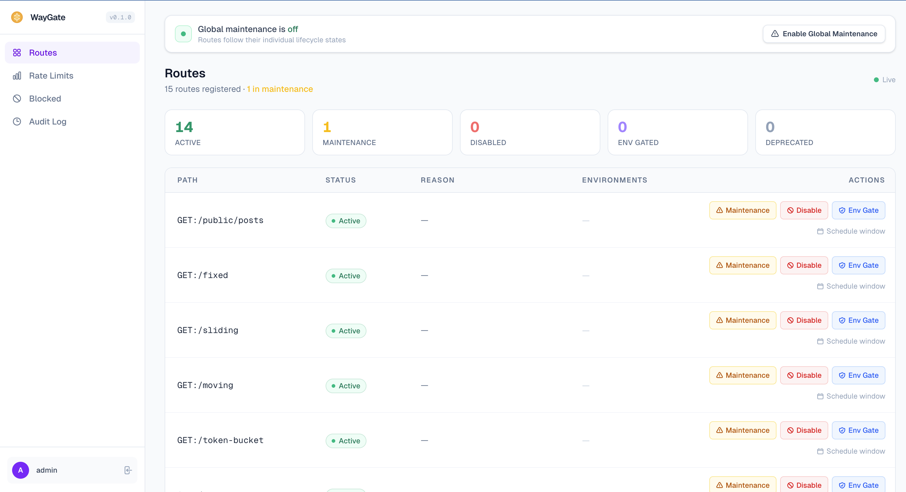

# Admin Dashboard

`WaygateAdmin` is the unified admin interface. It mounts the HTMX dashboard UI and the REST API (used by the CLI) under a single path.

---

## Mounting WaygateAdmin

```python
from fastapi import FastAPI
from waygate import WaygateEngine
from waygate.fastapi import WaygateMiddleware
from waygate.fastapi import WaygateAdmin

engine = WaygateEngine()

app = FastAPI()
app.add_middleware(WaygateMiddleware, engine=engine)

# Mount at /waygate — exposes dashboard UI + REST API
app.mount(
    "/waygate",
    WaygateAdmin(
        engine=engine,
        auth=("admin", "secret"),
        prefix="/waygate",
    ),
)
```

After starting the server:

- **Dashboard UI**: `http://localhost:8000/waygate/`
- **Audit log**: `http://localhost:8000/waygate/audit`
- **Rate limits**: `http://localhost:8000/waygate/rate-limits`
- **Blocked requests**: `http://localhost:8000/waygate/blocked`
- **REST API**: `http://localhost:8000/waygate/api/`

---

## Authentication

`auth=` accepts three forms:

=== "Single user"

    ```python
    WaygateAdmin(engine=engine, auth=("admin", "secret"))
    ```

=== "Multiple users"

    ```python
    WaygateAdmin(engine=engine, auth=[("alice", "pass1"), ("bob", "pass2")])
    ```

=== "Custom auth backend"

    ```python
    from waygate.fastapi import WaygateAuthBackend

    class MyDBAuth(WaygateAuthBackend):
        def authenticate_user(self, username: str, password: str) -> bool:
            return db.check(username, password)

    WaygateAdmin(engine=engine, auth=MyDBAuth())
    ```

=== "No auth (open access)"

    ```python
    WaygateAdmin(engine=engine)
    ```

!!! tip "Token invalidation"
    When you change `auth=` (new user, changed password), all previously issued tokens are automatically invalidated on restart, even if `secret_key` is stable. This is handled by mixing an auth fingerprint into the HMAC signing key.

---

## Dashboard UI

<figure class="screenshot" markdown>
  
  <figcaption>The admin dashboard showing route states, status badges, and per-route actions.</figcaption>
</figure>

The dashboard renders all registered routes with live status badges:

| Status | Colour | Description |
|---|---|---|
| `ACTIVE` | Green | Route responding normally |
| `MAINTENANCE` | Yellow | Route returning 503 |
| `DISABLED` | Red | Route permanently off |
| `ENV_GATED` | Blue | Route restricted to specific environments |
| `DEPRECATED` | Grey | Route still works but headers warn clients |

### Actions per route

- **Enable**: restore route to `ACTIVE`
- **Maintenance**: put in maintenance with optional reason + window
- **Disable**: permanently disable with reason
- **Env Gate**: open a modal to set the allowed environments (comma-separated). The current `allowed_envs` list is pre-filled. Submitting updates the route to `ENV_GATED` immediately; leaving the field empty and submitting is the same as calling `enable` to clear the gate.

### Live updates (SSE)

The dashboard connects to the `/waygate/events` SSE endpoint. When state changes (from another browser tab, CLI command, or API call), the affected row updates in real time without a page reload.

### Rate limits

`http://localhost:8000/waygate/rate-limits` shows all registered rate limit policies. Each row has three actions:

- **Reset** — clear counters immediately so clients get their full quota back
- **Edit** — update the limit, algorithm, or key strategy without redeploying
- **Delete** — remove a persisted policy override

Requires `waygate[rate-limit]` installed on the server.

### Blocked requests

`http://localhost:8000/waygate/blocked` shows a paginated log of every request that was rejected with a 429. The log is capped at 10,000 entries (configurable via `max_rl_hit_entries` on the engine).

### Audit log

`http://localhost:8000/waygate/audit` shows a paginated table of all state changes:

- Timestamp
- Route
- Action (enable / disable / maintenance / etc.)
- Actor (authenticated username or "anonymous")
- Platform (`cli` or `dashboard`)
- Status change — route status transitions shown as `old → new`; rate limit actions shown as coloured badges (`set`, `update`, `reset`, `delete`)
- Reason

---

## REST API

The same mount exposes a JSON API used by the `waygate` CLI:

| Method | Path | Description |
|---|---|---|
| `POST` | `/api/auth/login` | Exchange credentials for a bearer token |
| `POST` | `/api/auth/logout` | Revoke the current token |
| `GET` | `/api/auth/me` | Current actor info |
| `GET` | `/api/routes` | List all route states |
| `GET` | `/api/routes/{key}` | Get one route |
| `POST` | `/api/routes/{key}/enable` | Enable a route |
| `POST` | `/api/routes/{key}/disable` | Disable a route |
| `POST` | `/api/routes/{key}/maintenance` | Put route in maintenance |
| `POST` | `/api/routes/{key}/env` | Set env gate (`{"envs": ["dev", "staging"]}`) |
| `POST` | `/api/routes/{key}/schedule` | Schedule a maintenance window |
| `DELETE` | `/api/routes/{key}/schedule` | Cancel a scheduled window |
| `GET` | `/api/audit` | Audit log (`?route=` and `?limit=` params) |
| `GET` | `/api/global` | Global maintenance config |
| `POST` | `/api/global/enable` | Enable global maintenance |
| `POST` | `/api/global/disable` | Disable global maintenance |
| `GET` | `/api/rate-limits` | List all rate limit policies |
| `GET` | `/api/rate-limits/hits` | Blocked requests log |
| `DELETE` | `/api/rate-limits/{key}/reset` | Clear counters for a route |

---

## Advanced options

```python
WaygateAdmin(
    engine=engine,
    auth=("admin", "secret"),
    prefix="/waygate",             # must match the mount path
    secret_key="stable-key",      # omit in dev; set for production to survive restarts
    token_expiry=86400,           # token lifetime in seconds (default: 24 h)
)
```

| Option | Default | Description |
|---|---|---|
| `engine` | required | The `WaygateEngine` instance |
| `auth` | `None` (open) | Credentials (see forms above) |
| `prefix` | `"/waygate"` | Mount path prefix (must match `app.mount()`) |
| `secret_key` | random | HMAC signing key; set a stable value in production |
| `token_expiry` | `86400` | Token lifetime in seconds |

---

## Next step

[**Tutorial: CLI →**](cli.md)
