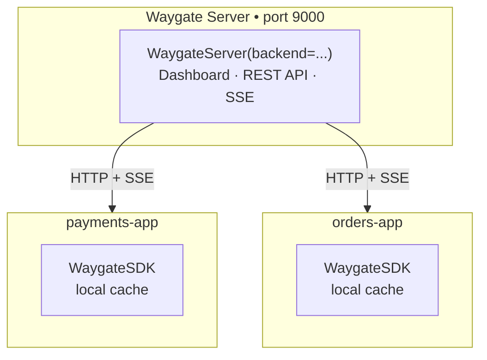

# Backends

A backend is where waygate stores route state and the audit log. Swapping backends requires a one-line change; everything else (decorators, middleware, CLI, audit log) works unchanged.

---

## Choosing a backend

| Backend | Persistence | Multi-instance | Best for |
|---|---|---|---|
| `MemoryBackend` | No | No | Development, testing |
| `FileBackend` | Yes | No (single process) | Simple single-instance deployments |
| `RedisBackend` | Yes | Yes | Production, load-balanced |
| Custom | You decide | You decide | Any other storage layer |

---

## MemoryBackend (default)

State lives in a Python `dict`. Lost on restart. The CLI cannot share state with the running server unless it also uses the in-process engine (e.g. via the admin API).

```python
from waygate import MemoryBackend
from waygate import WaygateEngine

engine = WaygateEngine(backend=MemoryBackend())
```

Best for: development, unit tests, demos.

---

## FileBackend

State is written to a JSON file on disk. The CLI and the running server share state as long as both point to the same file.

```python
from waygate import FileBackend
from waygate import WaygateEngine

engine = WaygateEngine(backend=FileBackend(path="waygate-state.json"))
```

Or via environment variables:

```bash
WAYGATE_BACKEND=file WAYGATE_FILE_PATH=./waygate-state.json uvicorn app:app
```

File format:

```json
{
  "states": {
    "GET:/payments": { "path": "GET:/payments", "status": "maintenance", ... }
  },
  "audit": [...]
}
```

Best for: single-instance deployments, CLI-driven workflows.

---

## RedisBackend

State is stored in Redis. All instances in a deployment share the same state. Pub/sub keeps the dashboard SSE feed live across instances.

```bash
uv add "waygate[redis]"
```

```python
from waygate import RedisBackend
from waygate import WaygateEngine

engine = WaygateEngine(backend=RedisBackend(url="redis://localhost:6379/0"))
```

Or via environment variable:

```bash
WAYGATE_BACKEND=redis WAYGATE_REDIS_URL=redis://localhost:6379/0 uvicorn app:app
```

Redis key schema:

| Key | Type | Description |
|---|---|---|
| `waygate:state:{path}` | String | JSON-serialised `RouteState` |
| `waygate:audit` | List | JSON-serialised `AuditEntry` items (capped at 1000) |
| `waygate:global` | String | JSON-serialised global maintenance config |
| `waygate:changes` | Pub/sub channel | Publishes on every `set_state` — used by SSE |

Best for: multi-instance / load-balanced production deployments.

!!! warning "Deploy Redis in the same region as your app"
    Every request runs at least one Redis read (`engine.check()`) and, when rate limiting
    is active, an additional Redis write. If your Redis instance is in a different region
    from your web service, each of those operations crosses a long-haul network link and
    adds latency to every request. Always provision Redis in the same region as the
    service that uses it.

---

## Waygate Server + WaygateSDK (multi-service)

When you run multiple independent services, a dedicated **Waygate Server** acts as the centralised control plane. Each service connects to it via **WaygateSDK**, which keeps an in-process cache synced over a persistent SSE connection — so enforcement never touches the network per request.



**Waygate Server setup:**

```python
from waygate.server import WaygateServer
from waygate import MemoryBackend

waygate_app = WaygateServer(
    backend=MemoryBackend(),
    auth=("admin", "secret"),
    token_expiry=3600,          # dashboard / CLI users: 1 hour
    sdk_token_expiry=31536000,  # SDK service tokens: 1 year (default)
)
# Run: uvicorn myapp:waygate_app --port 9000
```

**Service setup — three auth configurations:**

```python
from waygate.sdk import WaygateSDK
import os

# No auth on the Waygate Server — nothing needed
sdk = WaygateSDK(server_url="http://waygate-server:9000", app_id="payments-service")

# Auto-login (recommended for production): SDK logs in on startup with platform="sdk"
sdk = WaygateSDK(
    server_url=os.environ["WAYGATE_SERVER_URL"],
    app_id="payments-service",
    username=os.environ["WAYGATE_USERNAME"],
    password=os.environ["WAYGATE_PASSWORD"],
)

# Pre-issued token: obtain once via `waygate login`, store as a secret
sdk = WaygateSDK(
    server_url=os.environ["WAYGATE_SERVER_URL"],
    app_id="payments-service",
    token=os.environ["WAYGATE_TOKEN"],
)

sdk.attach(app)   # wires middleware + startup/shutdown
```

### Which backend should the Waygate Server use?

| Waygate Server instances | Backend choice |
|---|---|
| 1 (development) | `MemoryBackend` — state lives in-process, lost on restart |
| 1 (production) | `FileBackend` — state survives restarts |
| 2+ (HA / load-balanced) | `RedisBackend` — all Waygate Server nodes share state via pub/sub |

### Shared rate limit counters across SDK replicas

Each SDK client enforces rate limits locally using its own counters. When a service runs multiple replicas, each replica has independent counters — a `100/minute` limit is enforced independently per replica by default.

To enforce the limit **across all replicas combined**, pass a shared `RedisBackend` as `rate_limit_backend`:

```python
from waygate import RedisBackend

sdk = WaygateSDK(
    server_url="http://waygate-server:9000",
    app_id="payments-service",
    rate_limit_backend=RedisBackend(url="redis://redis:6379/1"),
)
```

### Deployment matrix

| Services | Replicas per service | Waygate Server backend | SDK `rate_limit_backend` |
|---|---|---|---|
| 1 | 1 | any — use embedded `WaygateAdmin` instead | — |
| 2+ | 1 each | `MemoryBackend` or `FileBackend` | not needed |
| 2+ | 2+ each | `RedisBackend` | `RedisBackend` |

See [**Waygate Server guide →**](../guides/waygate-server.md) for a complete walkthrough.

---

## Using `make_engine` (recommended)

`make_engine()` reads `WAYGATE_BACKEND` (and related env vars) so you never hardcode the backend:

```python
from waygate import make_engine

engine = make_engine()                           # reads env + .waygate file
engine = make_engine(current_env="staging")      # override env
engine = make_engine(backend="redis")            # force backend type
```

This lets you use `MemoryBackend` locally and `RedisBackend` in production without touching your app code.

---

## Custom backends

Any storage layer can be used by subclassing `WaygateBackend`:

```python
from waygate import WaygateBackend
from waygate import AuditEntry, RouteState

class MyBackend(WaygateBackend):

    async def get_state(self, path: str) -> RouteState:
        # MUST raise KeyError if not found
        ...

    async def set_state(self, path: str, state: RouteState) -> None:
        ...

    async def delete_state(self, path: str) -> None:
        ...

    async def list_states(self) -> list[RouteState]:
        ...

    async def write_audit(self, entry: AuditEntry) -> None:
        ...

    async def get_audit_log(
        self, path: str | None = None, limit: int = 100
    ) -> list[AuditEntry]:
        ...
```

See [**Adapters: Building your own backend →**](../adapters/custom.md) for a full SQLite example.

!!! warning "Storage latency affects every request"
    waygate calls your backend on every incoming request. If your storage layer is
    remote (PostgreSQL, SQLite over NFS, a hosted database), the round-trip time to that
    storage is added to every request that passes through the middleware. Keep your
    storage instance in the same data centre or region as your application. The same
    applies to rate limit storage — a slow counter increment slows down every request
    that has a rate limit applied.

---

## Lifecycle hooks

Override `startup()` and `shutdown()` for connection setup/teardown:

```python
class MyBackend(WaygateBackend):
    async def startup(self) -> None:
        self._conn = await connect_to_db()

    async def shutdown(self) -> None:
        await self._conn.close()
```

Use `async with engine:` in your app lifespan to call them automatically:

```python
from contextlib import asynccontextmanager

@asynccontextmanager
async def lifespan(app: FastAPI):
    async with engine:   # → backend.startup() … backend.shutdown()
        yield

app = FastAPI(lifespan=lifespan)
```

---

---

## Rate limit storage

Rate limit counters live separately from route state. The storage is auto-selected based on your main backend — you do not need to configure it separately.

| Backend | Rate limit storage | Multi-worker safe |
|---|---|---|
| `MemoryBackend` | In-process `MemoryRateLimitStorage` | No |
| `FileBackend` | In-memory counters with periodic snapshot (`FileRateLimitStorage`) | No |
| `RedisBackend` | Atomic Redis counters (`RedisRateLimitStorage`) | Yes |

For production deployments with multiple workers, use `RedisBackend`. Redis counters are atomic and shared across all processes.

```python
# Rate limit counters automatically use Redis when the main backend is Redis
engine = WaygateEngine(backend=RedisBackend("redis://localhost:6379/0"))
```

!!! warning "FileBackend and multi-worker"
    `FileRateLimitStorage` uses in-memory counters. Each worker process maintains its own independent counter, so the effective limit per client is `limit * num_workers`. Use `RedisBackend` for any deployment with more than one worker.

---

## Next step

[**Tutorial: Rate Limiting →**](rate-limiting.md)
