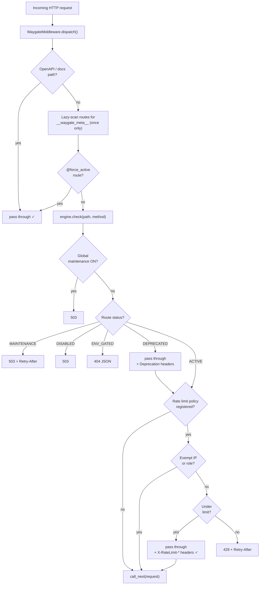

# Adding middleware

`WaygateMiddleware` is the enforcement layer. It intercepts every HTTP request, calls `engine.check()`, and returns the appropriate error response when a route is blocked. Without it, decorators register state but nothing enforces it.

The examples below use **FastAPI**.

---

## Basic setup

```python title="app.py"
from fastapi import FastAPI
from waygate import WaygateEngine
from waygate.fastapi import WaygateMiddleware

engine = WaygateEngine()  # uses MemoryBackend by default

app = FastAPI()
app.add_middleware(WaygateMiddleware, engine=engine)
```

!!! important
    Add `WaygateMiddleware` **before** including any routers so it wraps all routes.

---

## What the middleware does



---

## Route registration

The middleware auto-registers routes on first startup by scanning for `__waygate_meta__` on route handlers. This works with any router type: plain `APIRouter`, `WaygateRouter`, or routes added directly to the app.

If a route already has persisted state in the backend (for example, written by a previous CLI command), the decorator default is **ignored** and the persisted state wins. This means runtime changes survive restarts.

---

## Paths excluded from checks

The following paths always pass through regardless of waygate state:

- `/docs`, `/redoc`, `/openapi.json`: API documentation
- `/waygate/`: admin dashboard prefix

You can exclude additional paths by using `@force_active` on those routes.

---

## Global maintenance mode

The middleware also enforces **global** maintenance mode, a single switch that blocks every route at once:

```python
# Block everything immediately
await engine.enable_global_maintenance(
    reason="Emergency patch — back in 15 minutes",
    exempt_paths=["/health", "GET:/admin/status"],
)

# All non-exempt routes now return 503
# Restore normal operation
await engine.disable_global_maintenance()
```

See [**Reference: WaygateEngine**](../reference/engine.md) for the full global maintenance API.

---

## Response format

All error responses from the middleware use a consistent JSON structure:

```json
{
  "error": {
    "code": "MAINTENANCE_MODE",
    "message": "This endpoint is temporarily unavailable",
    "reason": "Database migration in progress",
    "path": "/api/payments",
    "retry_after": "2025-06-01T04:00:00Z"
  }
}
```

| Scenario | Status | `code` |
|---|---|---|
| Maintenance mode | 503 | `MAINTENANCE_MODE` |
| Route disabled | 503 | `ROUTE_DISABLED` |
| Env-gated (wrong env) | 403 | `ENV_GATED` |
| Global maintenance | 503 | `MAINTENANCE_MODE` |
| Rate limit exceeded | 429 | `RATE_LIMIT_EXCEEDED` |

---

## OpenAPI integration (FastAPI only)

FastAPI exposes a live OpenAPI schema at `/openapi.json`. Waygate can filter it to hide disabled and env-gated routes and annotate maintained or deprecated ones:

```python
from waygate.fastapi import apply_waygate_to_openapi

apply_waygate_to_openapi(app, engine)  # call after add_middleware
```

For enhanced docs UI with maintenance banners:

```python
from waygate.fastapi import apply_waygate_to_openapi, setup_waygate_docs

apply_waygate_to_openapi(app, engine)  # must come first
setup_waygate_docs(app, engine)        # inject banners into /docs and /redoc
```

See [**Reference: Middleware**](../reference/middleware.md) for all parameters.

---

## Next step

[**Tutorial: Backends →**](backends.md)
